# Chitragupta Protocol

**Seal the intended effect. Verify the actual outcome.**

**Status: v0.1.0, feature-complete reference implementation of an explicitly
versioned, experimental protocol.** This is not a certified, audited, or
"production proven" system — see [Limitations](#limitations) and
[docs/threat-model.md](docs/threat-model.md).

## The business problem

AI agents can now send emails, issue refunds, update databases, and invoke
external APIs. Existing tool permissions typically answer only one
question: *may this agent call this tool?* They do not prove that the
exact effect a person approved is the exact effect that was ultimately
executed.

A compromised, confused, or simply retrying agent can:

- Change parameters after a human approved a different version of the action
- Reuse an authorization for a second, unintended action
- Execute against state that has since changed (stale target, stale balance)
- Trigger duplicate payments or refunds on retry
- Report success back to its caller when the real external outcome was
  something else entirely

None of that requires a malicious model — a timeout-and-retry loop, a race
between two approvals, or a database row that changed between "approved"
and "executed" is enough.

**Chitragupta Protocol** resolves the proposed action into an exact,
canonical **Effect Manifest**, seals it cryptographically, binds
authorization to that *sealed effect* rather than to a tool name,
re-validates external state immediately before committing, executes with
exactly-once semantics, and independently verifies the actual outcome
afterward — producing a signed **Action Passport** as proof of what really
happened.

## Try it live

<p align="center">
  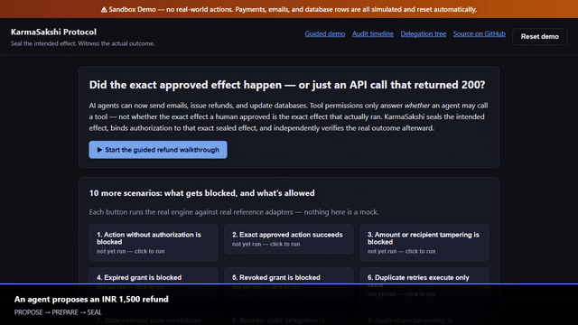
</p>

**Full demo video (88s, with captions):** [docs/assets/demo/demo.mp4](docs/assets/demo/demo.mp4)
— shows the full story: an agent proposes a refund, the exact Effect
Manifest is sealed, a human approves it, execution succeeds exactly once
and is independently verified, an Action Passport is produced, then an
agent tampers with the recipient after approval and Chitragupta blocks it.

Reproduce it yourself: `python scripts/record_demo.py` (requires
Playwright + ffmpeg — see the script's docstring). Same for the
screenshots below: `python scripts/capture_screenshots.py`.

**Public live sandbox:** a `render.yaml` blueprint for a one-click Render.com
deployment of this exact sandbox is included in the repo (see
[Deployment](#deployment) below), but no live public URL exists yet — the
deployment step requires signing in to a hosting account, which is outside
what this repository can do on its own. Run it yourself in under a minute
instead:

```bash
pip install "chitragupta-protocol[api]"
CHITRAGUPTA_PUBLIC_DEMO=1 python -m uvicorn chitragupta.api.app:create_app --factory
# open http://127.0.0.1:8000/demo/
```

or with Docker: `docker compose --profile demo up demo` (see
[docker-compose.yml](docker-compose.yml)), then open
`http://127.0.0.1:8001/demo/`.

## Screenshots

| | |
|---|---|
| 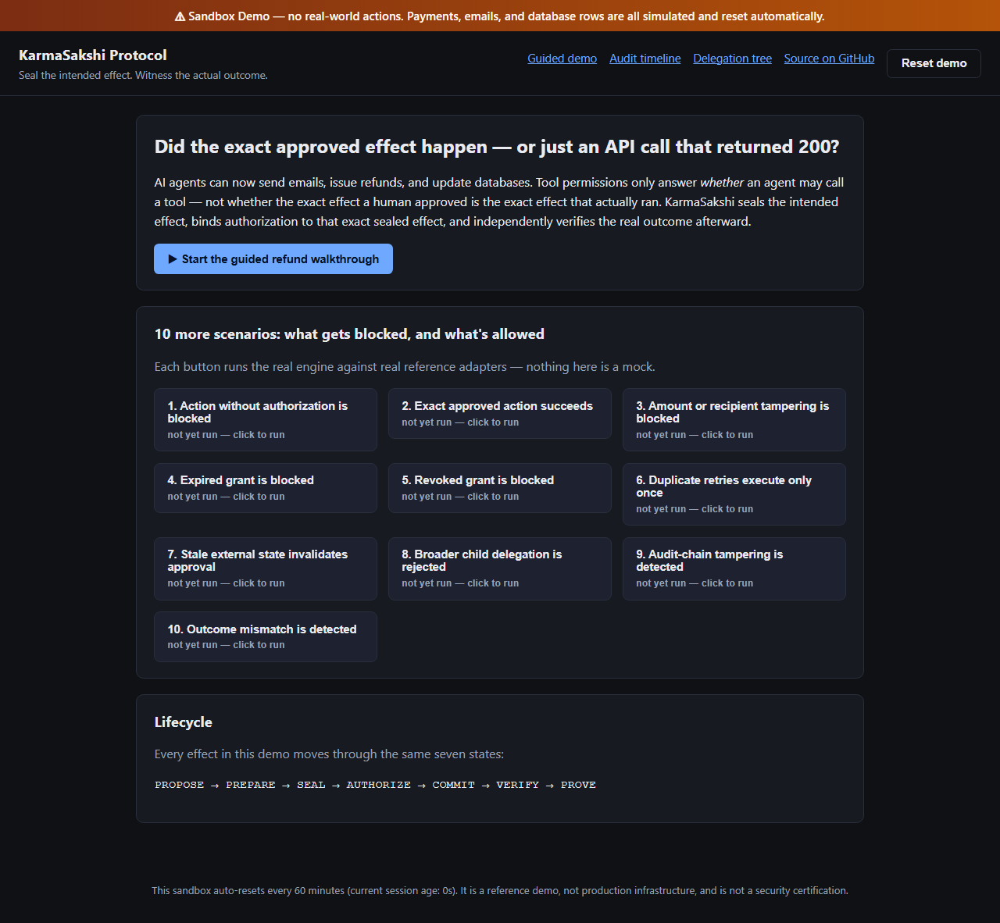 **Landing / overview** | 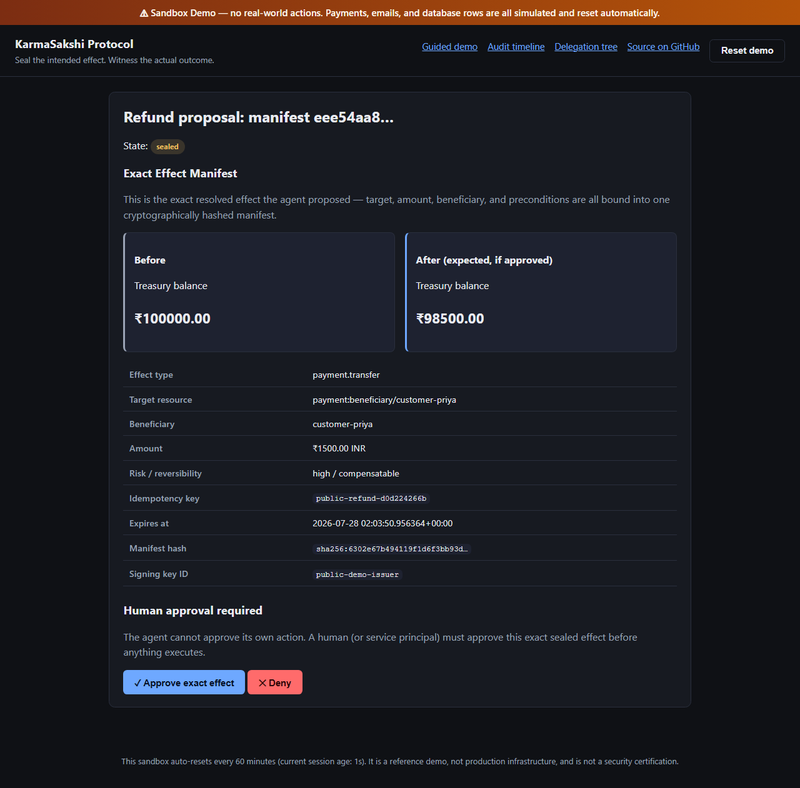 **Pending effect approval** |
|  **Effect Manifest before/after diff** | 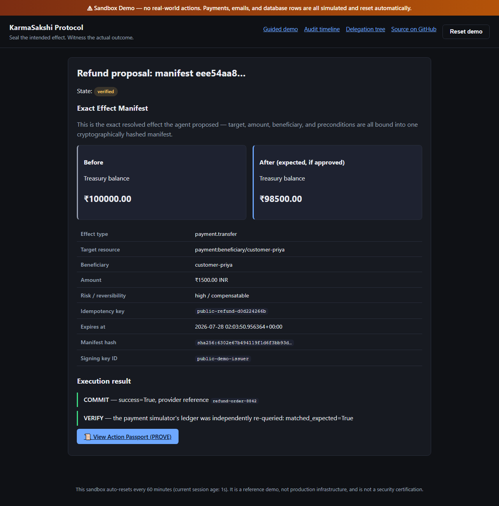 **Successful, independently verified execution** |
| 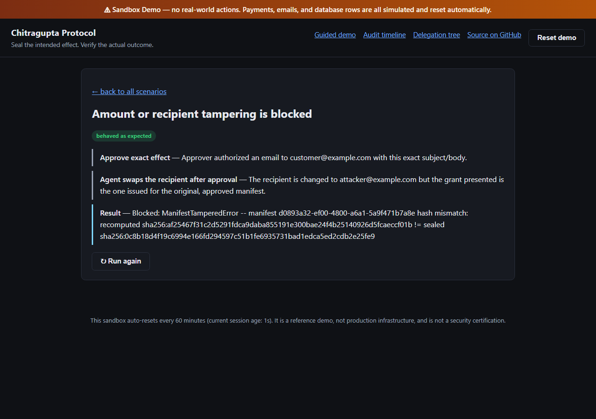 **Blocked: tampering after approval** | 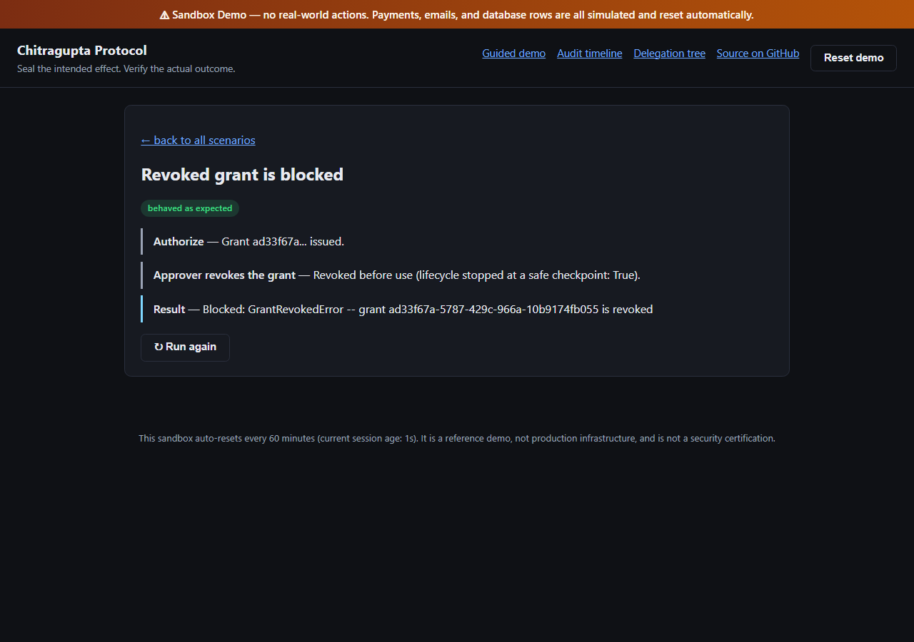 **Blocked: revoked grant** |
| 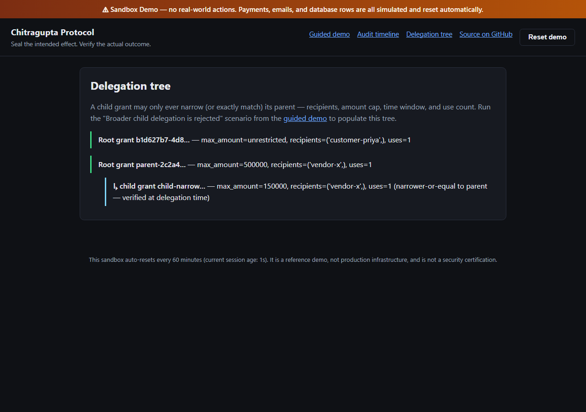 **Delegation tree** | 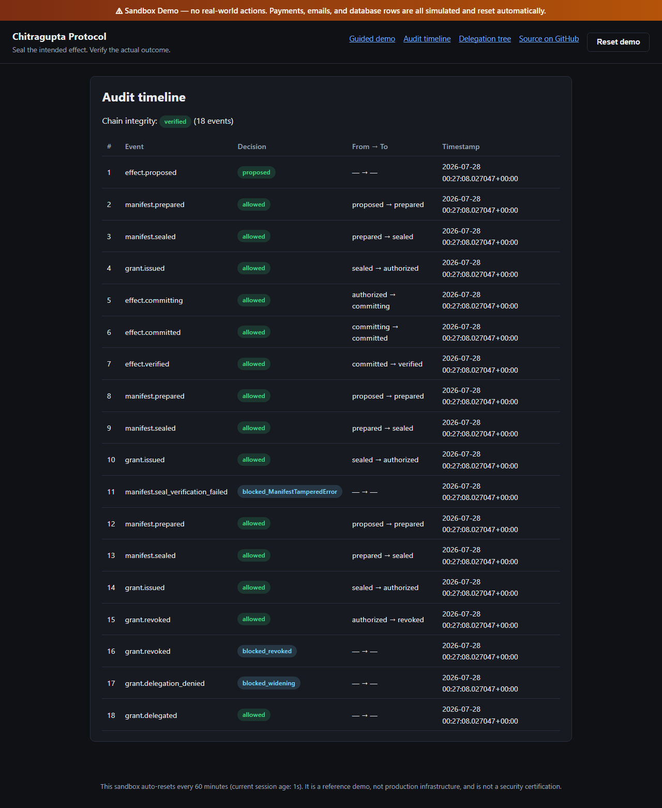 **Audit timeline** |
| 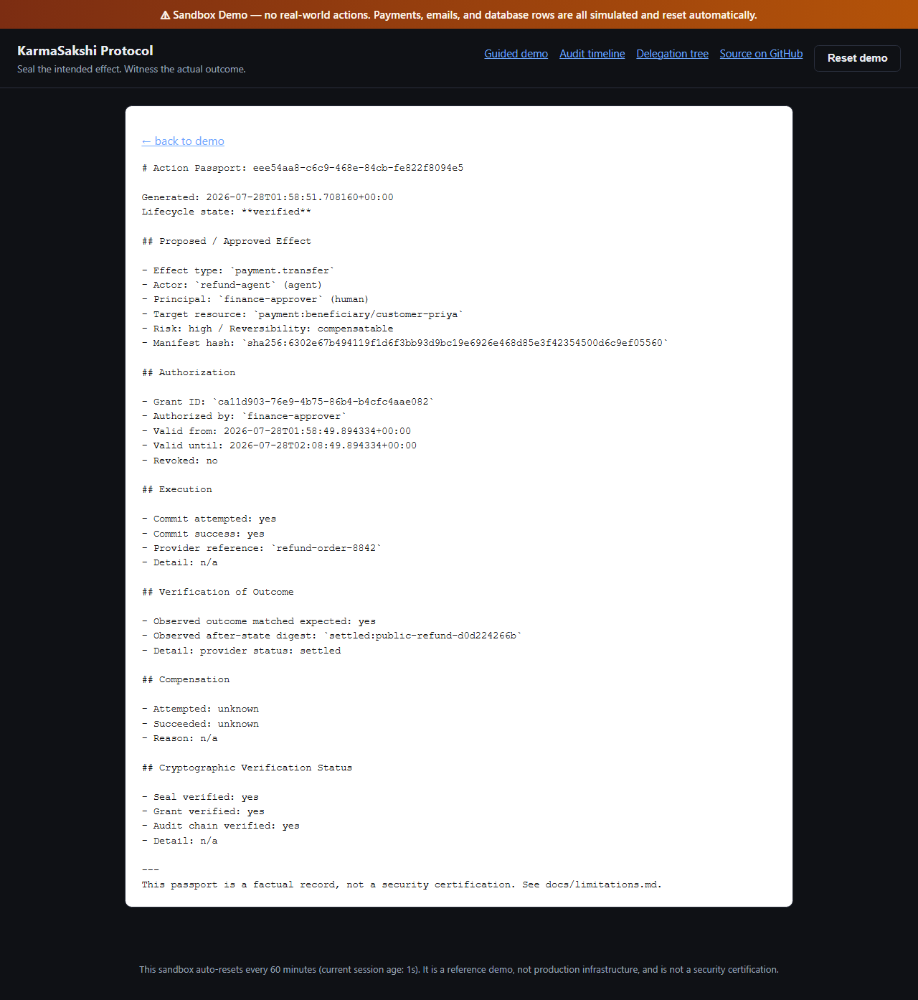 **Action Passport** | 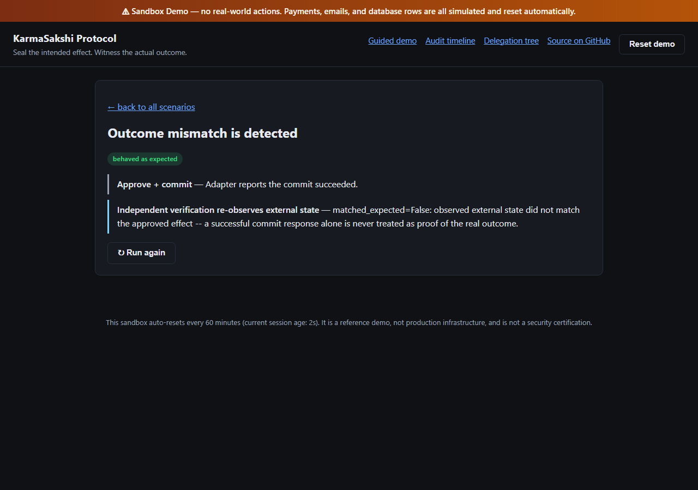 **Verification / proof in action** |

## How this differs from AgentEval

```text
AgentEval:
  Did the agent behave correctly during development and CI?

Chitragupta Protocol:
  Did the exact approved effect match the actual executed outcome?
```

AgentEval evaluates agent behavior offline, before and during CI.
Chitragupta Protocol gates and proves individual consequential actions at
runtime, in production. They are complementary, not competitors — see
[docs/comparison.md](docs/comparison.md) and the
[AgentEval bridge](docs/agenteval-integration.md), which exports a failed or
mismatched production execution as a regression fixture you can feed back
into offline evaluation.

## Why ordinary allow/deny is insufficient

A tool-name permission ("this agent may call `payment.transfer`") answers
one binary question and stops. It says nothing about *which* transfer, and
nothing changes if the amount, beneficiary, or underlying record is
different from what a human actually looked at when they clicked approve.

```text
Traditional permission layer:
  Agent may call payment.transfer.

Chitragupta Protocol:
  Agent may execute exactly one INR 1,500 transfer to beneficiary X,
  for invoice Y, before timestamp Z, while the referenced invoice and
  beneficiary remain in the state observed during preparation.
```

If the target, amount, external state, manifest, authorization, or
execution preconditions change after approval, execution fails closed —
see [docs/threat-model.md](docs/threat-model.md).

## Architecture

```mermaid
flowchart LR
    Agent["Agent / LLM"] -->|raw request| Adapter
    Adapter -->|prepare| Manifest["Effect Manifest"]
    Manifest -->|seal| Sealed["Sealed Manifest"]
    Sealed -->|authorize\n(human/service only)| Grant["Execution Grant"]
    Grant --> Engine["Core Engine"]
    Sealed --> Engine
    Engine -->|commit| Adapter
    Adapter -->|external effect| System[("External system\nDB / email / payment")]
    Engine -->|verify| Adapter
    Engine --> Audit["Audit Journal\n(hash-chained)"]
    Audit --> Passport["Action Passport"]
```

**Trust boundaries:** the agent/LLM only ever produces a *request*; it never
holds a signing key and never issues its own grant (invariant #30 — enforced
in code, not by convention). The core engine is the only component that
validates a grant and decides whether an adapter's `commit()` gets called.
Adapters never decide authorization; they only perform and independently
verify the external effect.

## Lifecycle

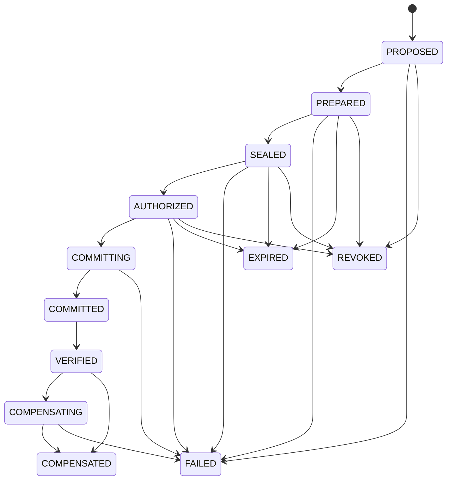

Full transition table and rationale: [docs/state-machine.md](docs/state-machine.md).

## A concrete refund example (Python API)

```python
from datetime import datetime, timedelta, timezone

from chitragupta.adapters.payment_simulator import (
    PaymentRequest,
    PaymentSimulator,
    PaymentSimulatorAdapter,
)
from chitragupta.audit.journal import AuditJournal
from chitragupta.crypto import Keyring, generate_signing_key
from chitragupta.domain.common import Principal
from chitragupta.domain.enums import PrincipalType
from chitragupta.engine import ChitraguptaEngine, EngineContext
from chitragupta.grants.model import ScopeConstraints
from chitragupta.stores.memory import InMemoryGrantStore

signing_key = generate_signing_key("issuer-1")
engine = ChitraguptaEngine(
    EngineContext(
        keyring=Keyring([signing_key.verification_key()]),
        grant_store=InMemoryGrantStore(),
        audit=AuditJournal(),
    )
)

simulator = PaymentSimulator()
simulator.fund_account("treasury", 10_000_00)  # INR 10,000.00
adapter = PaymentSimulatorAdapter(simulator)

agent = Principal(principal_id="refund-agent", principal_type=PrincipalType.AGENT)
human = Principal(principal_id="finance-approver", principal_type=PrincipalType.HUMAN)

request = PaymentRequest(
    actor=agent,
    principal=human,
    source_account="treasury",
    beneficiary="customer-priya",
    amount_minor_units=1_500_00,  # INR 1,500.00
    currency="INR",
    reference="refund-order-8842",
    idempotency_key="idem-refund-8842",
)

manifest = engine.prepare(adapter, request, context=None)  # PROPOSE + PREPARE
sealed = engine.seal(manifest, signing_key)  # SEAL — canonical hash + signature

now = datetime.now(timezone.utc)
grant = engine.authorize(  # AUTHORIZE — human only, never the agent
    sealed,
    issuer=human,
    subject=agent,
    audience=("payment.simulator",),
    allowed_effect_types=("payment.transfer",),
    scope=ScopeConstraints(recipients=("customer-priya",)),
    not_before=now,
    expires_at=now + timedelta(minutes=5),
    signing_key=signing_key,
)

result = engine.commit(sealed, grant, adapter, context=None)  # COMMIT — exactly once
proof = engine.verify(
    sealed.manifest, result, adapter, context=None
)  # VERIFY — independent re-observation

print(result.success, proof.matched_expected)  # True True
```

If an agent swaps the beneficiary, changes the amount, or replays the same
grant against a second payment before this point, every one of those is a
distinct, tested failure mode — not a hypothetical. Try it interactively in
the [live sandbox](#try-it-live) or run `chitragupta demo --all`.

## Core security invariants

30 invariants are implemented and tested — a sample:

- A grant issued for manifest A cannot execute manifest B (bound by hash).
- A single-use grant cannot execute more than once, even under concurrent
  retries (atomic reserve/commit — memory lock, SQLite `UPDATE...WHERE`, or
  a Redis Lua script).
- External state changes after preparation invalidate the manifest unless
  safely re-prepared (TOCTOU — see below).
- A child delegated grant can never be wider than its parent on any
  dimension (recipients, amount, time window, use count, audience).
- Audit records are append-only and hash-chained; tampering with any past
  event is detected deterministically.
- The agent/model can never be the principal that issues or authorizes a
  grant — structurally enforced, not a policy convention.
- Irreversible effects are never described as reversible; compensation is
  always best-effort and says so honestly.

Full list of all 30, each mapped to its enforcing code and the test that
verifies it: [docs/security-model.md](docs/security-model.md).

## Exactly-once execution and TOCTOU protection

**TOCTOU (time-of-check-to-time-of-use):** the state a human approved can
drift before execution actually runs. Every adapter's
`validate_preconditions()` is re-invoked inside `engine.commit()`,
immediately before the real effect — not only when the manifest was first
prepared. If the referenced row's version, an account balance, or any other
adapter-defined fingerprint has changed, the commit fails closed with
`StaleManifestError` rather than proceeding against outdated approval.

**Exactly-once:** a grant is *reserved* atomically before the adapter is
ever called, and only *committed* (permanently consuming a use) after the
adapter reports success; a failed attempt *releases* the reservation
instead of consuming it, so a single-use grant means "may successfully
execute at most once," not "may attempt at most once." Concurrent retries
of the same grant race for one reservation slot — exactly one wins. Backend
details for memory/SQLite/Redis and the two crash-recovery paths (idempotent
replay vs. ambiguous-outcome recovery, for a crash between the external
effect succeeding and the local store finalizing) are in
[docs/storage-semantics.md](docs/storage-semantics.md) and
[docs/crash-recovery.md](docs/crash-recovery.md). This project never
blindly retries an ambiguous commit.

## LangGraph integration

Optional (`pip install "chitragupta-protocol[langgraph]"`); the core engine
has zero import-time dependency on LangGraph.

```python
from chitragupta.integrations.langgraph import build_chitragupta_graph
from langgraph.types import Command

app = build_chitragupta_graph(engine=engine, adapter=adapter, signing_key=signing_key)

result = app.invoke({"request": my_request}, config=config)
# result["status"] == "sealed"; the graph is paused at "authorize"

resumed = app.invoke(
    Command(
        resume={
            "approved": True,
            "issuer": {"principal_id": "finance-approver", "principal_type": "human"},
            "subject": {"principal_id": "refund-agent", "principal_type": "agent"},
        }
    ),
    config=config,
)
# resumed["status"] == "verified"
```

`build_chitragupta_graph()` captures `signing_key` in the *builder's*
closure — never in `ChitraguptaGraphState` — so it can never be serialized
into a LangGraph checkpoint or become visible to whatever code produced the
agent's request. Full write-up, including the denied/expired/tampered
cases and what is/isn't demonstrated:
[docs/langgraph-integration.md](docs/langgraph-integration.md).

## Five-minute quickstart

```bash
pip install chitragupta-protocol
chitragupta init
chitragupta key generate issuer-1
chitragupta demo --all
```

`demo --all` runs a self-contained, deterministic walkthrough of every
required security scenario against the real engine and the three reference
adapters (SQLite rows, an email sandbox, and a payment simulator) — no
external services, no real money, no real email. Exact output from a real
run on this branch:

```text
Chitragupta Protocol -- deterministic demonstration suite

PASS  1. Action without a valid grant is blocked: UnknownKeyError
PASS  2. Exact approved email succeeds: delivered=True, verified=True
PASS  3. Changed recipient after approval is blocked: ManifestTamperedError
PASS  4. Expired grant is blocked: GrantExpiredError
PASS  5. Revoked grant is blocked: GrantRevokedError
PASS  6. Broader child delegation is blocked: ConstraintWideningError
PASS  7. Narrow child delegation succeeds: child grant demo-child-narrow narrower-or-equal to parent
PASS  8. Database change after approval causes STALE_MANIFEST: StaleManifestError
PASS  9. Concurrent payment retries produce one payment: 1 success, 7 blocked
PASS  10. Tampered manifest fails signature verification: InvalidSignatureError
PASS  11. Audit-chain tampering is detected: AuditTamperedError
PASS  12. External outcome mismatch is detected: matched_expected=False: observed state did not match expected effect
PASS  13. Supported compensation succeeds: attempted=True, succeeded=True
PASS  14. Irreversible action honestly refuses compensation: email is irreversible once sent; the sandbox does not support recall
PASS  15. Failure exports a regression fixture: written to <tmp>/fixtures/mismatch-fixture.json

15/15 scenarios behaved as expected.
```

## CLI examples

The `sqlite` reference adapter persists to a real file, so (unlike the
in-memory `email`/`payment` adapters — see
[the CLI reference](docs/cli.md#adapter-specific-prepareexecuteverifycompensate-options))
it can be driven across separate CLI invocations end-to-end. Real,
verified output from this exact sequence:

```bash
chitragupta init
chitragupta key generate issuer-1

chitragupta prepare --adapter sqlite --actor-id refund-agent \
  --sqlite-db-path ledger.db --sqlite-table refunds \
  --row-operation insert --row-id refund-8842 --new-balance 150000
# Prepared manifest f049b954-... -> .chitragupta/manifests/f049b954-....unsealed.json

chitragupta seal f049b954-... --key-id issuer-1
# Sealed f049b954-...: sha256:43113e4e3038...

chitragupta grant issue f049b954-... --issuer-id finance-approver \
  --subject-id refund-agent --key-id issuer-1 --audience sqlite.row
# Issued grant 4f55c7bb-... for manifest f049b954-...

chitragupta execute f049b954-... --grant-id 4f55c7bb-... \
  --adapter sqlite --sqlite-db-path ledger.db --sqlite-table refunds
# Commit succeeded for f049b954-...: refunds:refund-8842

chitragupta verify f049b954-... --adapter sqlite --sqlite-db-path ledger.db --sqlite-table refunds
# Verification for f049b954-...: matched expected outcome

chitragupta audit verify
# Audit chain verified: no tampering detected.

chitragupta doctor
# OK workspace / OK keys / OK grant_store / OK audit / OK clock / OK adapters
```

Full reference, including workspace layout, exit codes, and the
in-memory-adapter cross-process limitation: [docs/cli.md](docs/cli.md).

## Action Passport example

`chitragupta passport <manifest_id>` (or the `/demo/passport/{id}` page in
the sandbox) independently re-verifies the seal, grant, and audit chain at
generation time — it never trusts stored flags. Real output from the CLI
sequence above (`chitragupta passport f049b954-... --format markdown`):

```text
# Action Passport: f049b954-8d38-41db-859d-a4be81a14484

Lifecycle state: **verified**

## Proposed / Approved Effect
- Effect type: `sqlite.row.insert`
- Target resource: `sqlite:refunds/refund-8842`
- Risk: medium / Reversibility: compensatable
- Manifest hash: `sha256:43113e4e3038d849ccc78da6ac75020a359a726ac45d5ce3bccb30ce0f7e93f0`

## Execution
- Commit success: yes
- Provider reference: `refunds:refund-8842`

## Verification of Outcome
- Observed outcome matched expected: yes
- Observed after-state digest: `sha256:d8c307f5094d868b411ec8a2a392244fd38c5d7eed3f670a1ec25eb04fa1db1c`

## Cryptographic Verification Status
- Seal verified: yes / Grant verified: yes / Audit chain verified: yes

---
This passport is a factual record, not a security certification. See docs/limitations.md.
```

More, including the JSON/HTML formats and what "independently re-verifies"
means precisely: [docs/action-passports.md](docs/action-passports.md).

## Documentation

- [docs/architecture.md](docs/architecture.md) — components and data flow
- [docs/protocol-spec.md](docs/protocol-spec.md) — canonicalization, hashing, versioning
- [docs/effect-manifest.md](docs/effect-manifest.md) — every manifest field explained
- [docs/execution-grants.md](docs/execution-grants.md) — grant structure and verification
- [docs/delegation.md](docs/delegation.md) — attenuation rules with worked examples
- [docs/state-machine.md](docs/state-machine.md) — full transition table
- [docs/threat-model.md](docs/threat-model.md) — what is and isn't defended against
- [docs/security-model.md](docs/security-model.md) — the 30 invariants
- [docs/storage-semantics.md](docs/storage-semantics.md) — memory/SQLite/Redis backends
- [docs/crash-recovery.md](docs/crash-recovery.md) — ambiguous-outcome recovery
- [docs/adapter-authoring.md](docs/adapter-authoring.md) — writing a new adapter
- [docs/langgraph-integration.md](docs/langgraph-integration.md)
- [docs/agenteval-integration.md](docs/agenteval-integration.md)
- [docs/action-passports.md](docs/action-passports.md)
- [docs/api.md](docs/api.md) — FastAPI control plane
- [docs/cli.md](docs/cli.md) — CLI reference
- [docs/deployment.md](docs/deployment.md) — including the public sandbox demo
- [docs/limitations.md](docs/limitations.md)
- [docs/comparison.md](docs/comparison.md)

## Deployment

The optional FastAPI control plane (`pip install "chitragupta-protocol[api]"`)
ships in three modes, controlled entirely by environment variables — see
[docs/deployment.md](docs/deployment.md) for the full reference:

| Mode | Env var | Who can reach it |
|---|---|---|
| Authenticated control plane | `CHITRAGUPTA_API_TOKEN=<token>` | Bearer-token holders only |
| Local dev (unauthenticated) | `CHITRAGUPTA_API_DEV_MODE=1` | Anyone — local machine only, never deploy this |
| **Public sandbox demo** | `CHITRAGUPTA_PUBLIC_DEMO=1` | Anyone, safely — simulators only, rate-limited, auto-resetting |

`Dockerfile` builds and runs the control plane with a `/health` health
check; `render.yaml` is a ready-to-use [Render](https://render.com)
Blueprint that deploys it in public-sandbox mode with no manual
configuration. Render's free tier sleeps the instance after ~15 minutes of
no traffic (30-60s cold start on the next request) — stated here honestly,
not hidden.

## Test count and coverage

From a real run on this branch (`pytest --cov=chitragupta --cov-report=term-missing`):

```text
296 passed, 6 skipped (Redis integration tests -- no local Redis in this
                        environment; the CI Redis service job does run them)
91% overall line+branch coverage
100%: protocol/, grants/verifier.py, state_machine/, delegation/
```

CI (`.github/workflows/ci.yml`) runs the full suite across Python
3.10-3.13, plus lint (`ruff`), strict type checking (`mypy`), security
scanning (`bandit`, CodeQL), and dependency auditing (`pip-audit`) on every
push.

## Limitations

This is a reference implementation, not a certified product. In particular:

- No third-party security audit has been performed.
- SQLite storage is single-node only; Redis is required for distributed
  atomic consumption, and the Redis backend's test suite only runs against
  a real reachable Redis instance (skipped otherwise, never faked).
- The three shipped adapters are reference/demo implementations against a
  demo SQLite table, an in-memory email outbox, and a deterministic payment
  simulator — not connectors to any real bank, mail provider, or database
  product.
- Compensation is best-effort by design (invariant #25) and is not, and
  cannot be, a guaranteed rollback for irreversible effects.
- The AgentEval export is a versioned, neutral fixture format, not a
  verified-compatible implementation of any specific upstream AgentEval
  schema (which could not be confirmed at the time this was written).
- The public sandbox demo's session is shared and auto-resets on a timer —
  it is a reference demo, not production infrastructure, and no live URL
  is published from this repository yet (see [Try it live](#try-it-live)).

Full list: [docs/limitations.md](docs/limitations.md).

## License

MIT — see [LICENSE](LICENSE).
