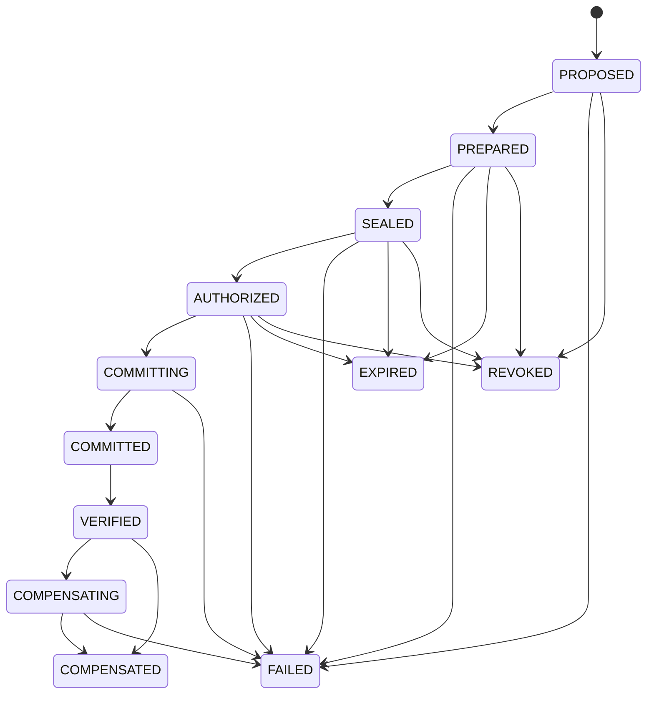

# Chitragupta Protocol

> Seal the intended effect. Verify the actual outcome.

**Status: v0.1.0, feature-complete reference implementation of an explicitly
versioned, experimental protocol.** This is not a certified, audited, or
"production proven" system — see [Limitations](#limitations) and
[docs/threat-model.md](docs/threat-model.md).

## The problem

Agent frameworks make it trivial for a model to call `payment.transfer`,
`email.send`, or `db.update`. Most permission layers stop at authorizing the
*tool* — "this agent may call `payment.transfer`" — or at best a fuzzy
description of intent. They do not bind authorization to the *exact resolved
effect*: which beneficiary, which amount, which invoice, before what
deadline, conditioned on the invoice and beneficiary still being in the
state observed when the human approved it.

That gap is where things go wrong: the model resolves "pay the vendor" into
a specific transfer, a human approves *something*, and by the time the tool
call actually executes, the target, the amount, or the underlying record may
have changed — and nothing in the stack would have noticed.

Chitragupta Protocol closes that gap with a seven-step lifecycle
(`PROPOSE → PREPARE → SEAL → AUTHORIZE → COMMIT → VERIFY → PROVE`) built
around one primitive: the **Effect Manifest** — a canonical, hashed,
signed record of the exact change about to happen — and one authorization
object: the **Execution Grant** — a signed, single-use-by-default,
expiring, revocable permission bound to that exact manifest's hash, never
to a tool name.

```text
Traditional permission layer:
  Agent may call payment.transfer.

Chitragupta Protocol:
  Agent may execute exactly one INR 1,500 transfer to beneficiary X,
  for invoice Y, before timestamp Z, while the referenced invoice and
  beneficiary remain in the state observed during preparation.
```

If the target, amount, external state, manifest, authorization, or
execution preconditions change after approval, execution fails closed.

### How this differs from AgentEval

```text
AgentEval:
  Did the agent behave correctly during development and CI?

Chitragupta Protocol:
  Did the exact approved real-world effect match the actual outcome?
```

AgentEval evaluates agent behavior offline. Chitragupta Protocol gates and
proves individual consequential actions at runtime. They are complementary,
not competitors — see [docs/comparison.md](docs/comparison.md) and the
[AgentEval bridge](docs/agenteval-integration.md), which exports a failed or
mismatched production execution as a regression fixture.

## Install

```bash
pip install chitragupta-protocol
```

## Five-minute quickstart

```bash
chitragupta init
chitragupta key generate issuer-1
chitragupta demo --all
```

`demo --all` runs a self-contained, deterministic walkthrough of every
required security scenario against the real engine and the three reference
adapters (SQLite rows, an email sandbox, and a payment simulator) — no
external services, no real money, no real email. Exact output from a real
run on this branch:

```text
Chitragupta Protocol -- deterministic demonstration suite

PASS  1. Action without a valid grant is blocked: UnknownKeyError
PASS  2. Exact approved email succeeds: delivered=True, verified=True
PASS  3. Changed recipient after approval is blocked: ManifestTamperedError
PASS  4. Expired grant is blocked: GrantExpiredError
PASS  5. Revoked grant is blocked: GrantRevokedError
PASS  6. Broader child delegation is blocked: ConstraintWideningError
PASS  7. Narrow child delegation succeeds: child grant demo-child-narrow narrower-or-equal to parent
PASS  8. Database change after approval causes STALE_MANIFEST: StaleManifestError
PASS  9. Concurrent payment retries produce one payment: 1 success, 7 blocked
PASS  10. Tampered manifest fails signature verification: InvalidSignatureError
PASS  11. Audit-chain tampering is detected: AuditTamperedError
PASS  12. External outcome mismatch is detected: matched_expected=False: observed state did not match expected effect
PASS  13. Supported compensation succeeds: attempted=True, succeeded=True
PASS  14. Irreversible action honestly refuses compensation: email is irreversible once sent; the sandbox does not support recall
PASS  15. Failure exports a regression fixture: written to <tmp>/fixtures/mismatch-fixture.json

15/15 scenarios behaved as expected.
```

## A runnable example (Python API)

```python
from datetime import datetime, timedelta, timezone

from chitragupta.adapters.payment_simulator import (
    PaymentRequest,
    PaymentSimulator,
    PaymentSimulatorAdapter,
)
from chitragupta.audit.journal import AuditJournal
from chitragupta.crypto import Keyring, generate_signing_key
from chitragupta.domain.common import Principal
from chitragupta.domain.enums import PrincipalType
from chitragupta.engine import ChitraguptaEngine, EngineContext
from chitragupta.grants.model import ScopeConstraints
from chitragupta.stores.memory import InMemoryGrantStore

signing_key = generate_signing_key("issuer-1")
engine = ChitraguptaEngine(
    EngineContext(
        keyring=Keyring([signing_key.verification_key()]),
        grant_store=InMemoryGrantStore(),
        audit=AuditJournal(),
    )
)

simulator = PaymentSimulator()
simulator.fund_account("acct-src", 1_000_000)
adapter = PaymentSimulatorAdapter(simulator)

agent = Principal(principal_id="agent-1", principal_type=PrincipalType.AGENT)
human = Principal(principal_id="alice", principal_type=PrincipalType.HUMAN)

request = PaymentRequest(
    actor=agent,
    principal=human,
    source_account="acct-src",
    beneficiary="merchant-A",
    amount_minor_units=150_000,
    currency="INR",
    reference="invoice-42",
    idempotency_key="idem-42",
)

manifest = engine.prepare(adapter, request, context=None)  # PROPOSE + PREPARE
sealed = engine.seal(manifest, signing_key)  # SEAL

now = datetime.now(timezone.utc)
grant = engine.authorize(  # AUTHORIZE
    sealed,
    issuer=human,
    subject=agent,
    audience=("payment.simulator",),
    allowed_effect_types=("payment.transfer",),
    scope=ScopeConstraints(),
    not_before=now,
    expires_at=now + timedelta(minutes=5),
    signing_key=signing_key,
)

result = engine.commit(sealed, grant, adapter, context=None)  # COMMIT
proof = engine.verify(sealed.manifest, result, adapter, context=None)  # VERIFY

print(result.success, proof.matched_expected)  # True True
```

## Architecture

```mermaid
flowchart LR
    Agent["Agent / LLM"] -->|raw request| Adapter
    Adapter -->|prepare| Manifest["Effect Manifest"]
    Manifest -->|seal| Sealed["Sealed Manifest"]
    Sealed -->|authorize\n(human/service only)| Grant["Execution Grant"]
    Grant --> Engine["Core Engine"]
    Sealed --> Engine
    Engine -->|commit| Adapter
    Adapter -->|external effect| System[("External system\nDB / email / payment")]
    Engine -->|verify| Adapter
    Engine --> Audit["Audit Journal\n(hash-chained)"]
    Audit --> Passport["Action Passport"]
```

**Trust boundaries:** the agent/LLM only ever produces a *request*; it never
holds a signing key and never issues its own grant (invariant #30 — enforced
in code, not by convention). The core engine is the only component that
validates a grant and decides whether an adapter's `commit()` gets called.
Adapters never decide authorization; they only perform and independently
verify the external effect.

## Lifecycle



Full transition table and rationale: [docs/state-machine.md](docs/state-machine.md).

## Security invariants

30 invariants are implemented and tested — grant/manifest binding, TOCTOU
precondition re-validation, atomic exactly-once consumption, delegation
attenuation, fail-closed storage/audit failures, and more. Full list with
the test(s) that verify each one: [docs/security-model.md](docs/security-model.md).

## Documentation

- [docs/architecture.md](docs/architecture.md) — components and data flow
- [docs/protocol-spec.md](docs/protocol-spec.md) — canonicalization, hashing, versioning
- [docs/effect-manifest.md](docs/effect-manifest.md) — every manifest field explained
- [docs/execution-grants.md](docs/execution-grants.md) — grant structure and verification
- [docs/delegation.md](docs/delegation.md) — attenuation rules with worked examples
- [docs/state-machine.md](docs/state-machine.md) — full transition table
- [docs/threat-model.md](docs/threat-model.md) — what is and isn't defended against
- [docs/security-model.md](docs/security-model.md) — the 30 invariants
- [docs/storage-semantics.md](docs/storage-semantics.md) — memory/SQLite/Redis backends
- [docs/crash-recovery.md](docs/crash-recovery.md) — ambiguous-outcome recovery
- [docs/adapter-authoring.md](docs/adapter-authoring.md) — writing a new adapter
- [docs/langgraph-integration.md](docs/langgraph-integration.md)
- [docs/agenteval-integration.md](docs/agenteval-integration.md)
- [docs/action-passports.md](docs/action-passports.md)
- [docs/api.md](docs/api.md) — FastAPI control plane
- [docs/cli.md](docs/cli.md) — CLI reference
- [docs/deployment.md](docs/deployment.md)
- [docs/limitations.md](docs/limitations.md)
- [docs/comparison.md](docs/comparison.md)

## Limitations

This is a reference implementation, not a certified product. In particular:

- No third-party security audit has been performed.
- SQLite storage is single-node only; Redis is required for distributed
  atomic consumption, and the Redis backend's test suite only runs against
  a real reachable Redis instance (skipped otherwise, never faked).
- The three shipped adapters are reference/demo implementations against a
  demo SQLite table, an in-memory email outbox, and a deterministic payment
  simulator — not connectors to any real bank, mail provider, or database
  product.
- Compensation is best-effort by design (invariant #25) and is not, and
  cannot be, a guaranteed rollback for irreversible effects.
- The AgentEval export is a versioned, neutral fixture format, not a
  verified-compatible implementation of any specific upstream AgentEval
  schema (which could not be confirmed at the time this was written).

Full list: [docs/limitations.md](docs/limitations.md).

## License

MIT — see [LICENSE](LICENSE).
