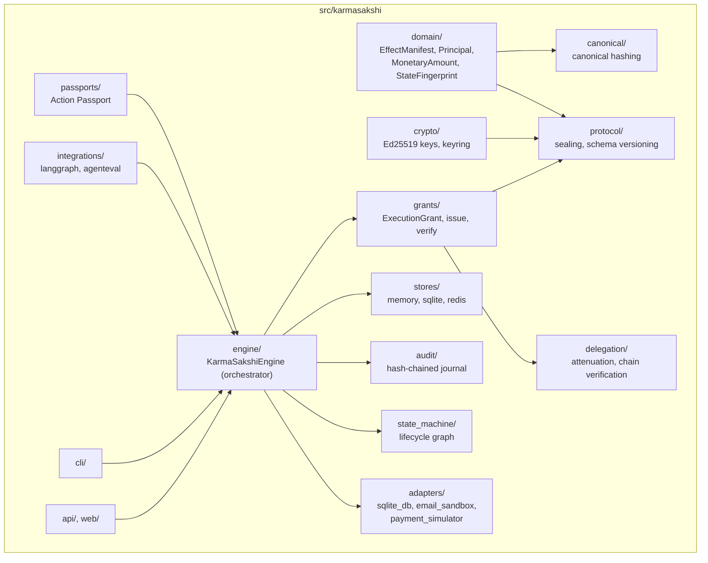

# Architecture

The mechanisms that make this a **verified effect commit protocol** rather
than a permission layer are the manifest canonicalization/sealing
(`domain/`, `canonical/`, `protocol/`), commit-time precondition
revalidation and atomic reservation (`engine/core.py`'s `commit()`), and
independent post-commit verification (`adapter.verify()`, `passports/`).
`grants/` and `delegation/` scope, expire, and narrow *who may approve
what* — real, tested controls, but supporting ones; they do not by
themselves prove an effect happened as approved. See the README's
["Core security invariants"](../README.md#core-security-invariants)
section for the full primary-vs-supporting breakdown.

## Components

Dependency direction is one-way: `engine` depends on `domain`, `grants`,
`stores`, `audit`, `state_machine`, and the `adapters` *contract*
(`adapters/base.py`); it has zero dependency on any concrete adapter,
`cli`, `api`, or `integrations`. `cli` and `api` depend on `engine`, never
the reverse. `integrations/langgraph` and `integrations/agenteval` are
optional and import-guarded — the core engine has no import-time
dependency on either.

## Data flow (one effect, start to finish)

1. **PROPOSE** — the agent/caller produces a raw, adapter-specific request
   object (e.g. `PaymentRequest`). This is not yet trusted or resolved.
2. **PREPARE** — `engine.prepare(adapter, request, context)` calls the
   adapter's own `prepare()`, which resolves the request into an
   `EffectManifest`: exact target, canonically-normalized parameters, a
   `StateFingerprint` precondition, risk/reversibility classification.
3. **SEAL** — `engine.seal(manifest, signing_key)` computes the manifest's
   canonical hash and signs it (Ed25519), producing a `SealedManifest`.
4. **AUTHORIZE** — a human or service principal (never the agent —
   invariant #30) calls `engine.authorize(...)`, which re-verifies the seal
   and mints a signed, scoped, expiring `ExecutionGrant` bound to that exact
   manifest hash.
5. **COMMIT** — `engine.commit(sealed, grant, adapter, context)` re-verifies
   the seal *and* the grant, checks manifest-hash binding, adapter
   identity/version, effect-type/audience scope, revocation, atomically
   reserves the grant, checks the idempotency ledger for a prior replay,
   re-validates preconditions (TOCTOU), and only then calls
   `adapter.commit()`.
6. **VERIFY** — `engine.verify(...)` calls `adapter.verify()`, which
   independently re-observes external state rather than trusting the commit
   result (invariant #21).
7. **PROVE** — `karmasakshi.passports.build_passport(...)` assembles an
   Action Passport from the sealed manifest, grant, commit result, outcome
   proof, and audit journal.

Every transition in this pipeline — allowed or blocked — is written to the
audit journal before anything else happens at that step.

## Process model

`KarmaSakshiEngine` holds lifecycle state (`LifecycleRecord`) in memory,
keyed by `manifest_id`. This is intentional: the *durable* record of what
happened is always the audit journal (in-memory for tests, SQLite-backed
for the CLI and API by default, pluggable to Redis for the grant store).
A long-running host that reconstructs a fresh engine per request (the CLI
is the extreme case: a fresh process per command) uses
`engine.seed_lifecycle_state()` / `Workspace.reconstruct_lifecycle_state()`
to replay the audit journal and restore the correct in-memory state before
continuing — see [docs/crash-recovery.md](crash-recovery.md).
